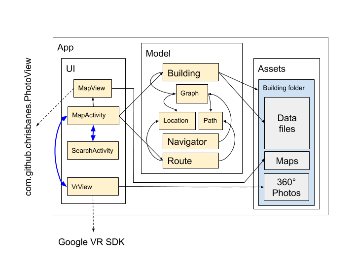
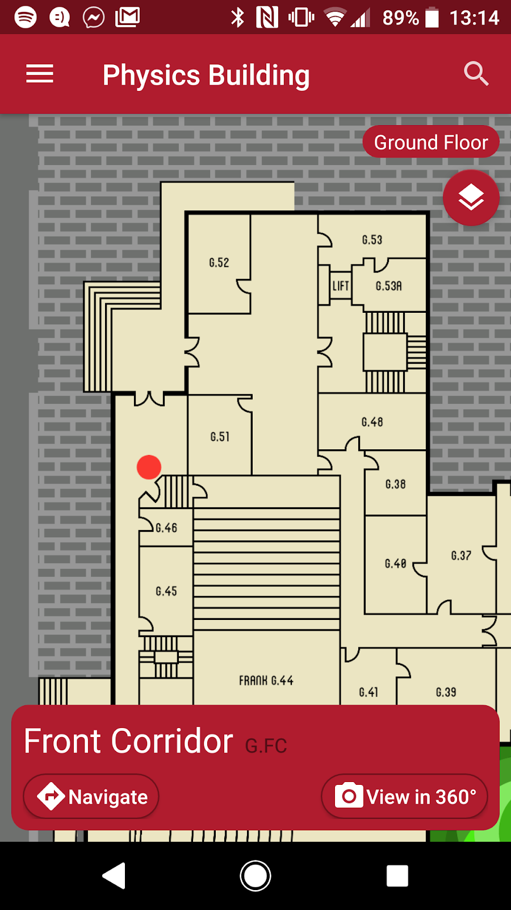
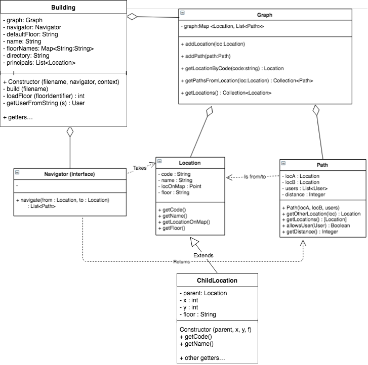

# Architecture & Design

 

The diagram above shows the major parts of the finished application. An unstyled arrow from **A** to **B** denotes use (of some manner) of **B** by **A**. A dashed arrow denotes an external dependency, and blue arrows represent the flow of control within the UI. Yellow-shaded elements represent classes.

The app’s assets contain a fully functional model of the Physics Building, complete with maps and 360° photos. We have also included a placeholder for the Fry Building which can be edited and tested just by building the app. (Requirement **4.1**) We have constructed the physics graph in a way that satisfies requirements **3.1**-**3.3**.

**MapActivity** is the main and the start-up Android Activity for the app, where the building is loaded, displayed and explored. It can be in one of four states: **Idle**, **Selection**, **Navigation** and **Directions**, each representing some stage between the user opening the app and actually following the directions generated for a route. A screenshot of this activity in the **Selection** state is shown above. It also provides a means to change floors, and the **Settings** drawer can be accessed with the button in the top left, or by swiping from the left edge of the screen. The map is displayed using our **MapView** class, which itself extends **PhotoView** by Chris Banes.

**SearchActivity** is launched either by the search button in the top right of **MapActivity**, or on selection of a route endpoint. It presents a list of recently searched locations to the user, who can then either select one of these or use the search field to find any location, by name or code. The result will be selected or set as the navigation endpoint. The user may also cancel, and control returns to **MapActivity** at the point where the search was launched.

**VrView** uses Google’s VR SDK to present 360° photos of locations where possible. It is only accessible from the **Selection** state of the **Map Activity**, and must be closed using the back button.

## Model & Navigator

The **Building** class is the main model entity for our system - it contains superficial information, including the building name, structural data such as the different floors, locations and paths in the building, and metadata to remember the building’s associated folder. Every query from the UI layer of the application is answered through the **Building** class. The **Location**, **Path** and **Graph** classes exist to store the aforementioned structural data - **Location** and **Path** represent their eponymous counterparts in the real world, while **Graph** maintains the relationships between them.

The above extension of our original class diagram shows the relationships between classes in our model. Note the addition of the **ChildLocation** class, whose **getCode** and **getName** functions are redirected to those of its **parent** property. In our previous release, we allowed multiple locations with the same code (e.g. multiple entrances to a room), but this resulted in a higher risk of data errors as we essentially had copies of the location’s name all over the data files, which were sometimes not all updated correctly. The **ChildLocation** class helps to mitigate this - the **Building** will populate its **principals** list with the first location it loads for each code, then instantiate subsequently loaded locations with the same code as children of this.

The **Navigator** interface is what gives a usable path between origin and destination, with different implementations using different rules: specifically the different access requirements of our users. **Building** objects have an associated **Navigator** at all times. We chose to create **Navigator** as an interface as this makes it easy to change the way the app finds the route - we can use different implementations to represent search algorithms. All implementations take into account the **users** property of the **Path** objects they work on, and will only consider a path if the current user can access it. (Requirement **2.1**-**2.2**)

We considered and implemented several search algorithms, from unweighted breadth-first search through a weighted (programatically, by map location) application of Dijkstra’s shortest-path algorithm and more. (Requirement **1.1**-**1.2**)

The final implementation uses a bidirectional version of the weighted Dijkstra navigator, which is much faster than other implementations and satisfies requirement **5/5.1**.
