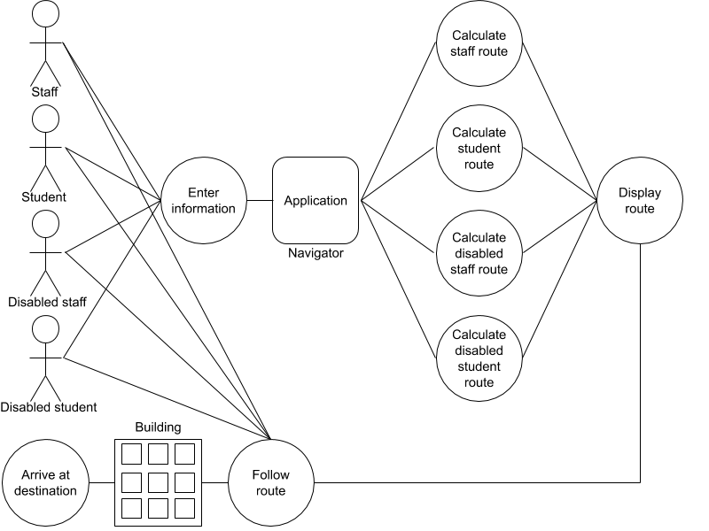

# Requirements

## Stakeholders

The following stakeholders are present in our system:

*   Client
    *   John Newby - Needs to be able to convert the application for use with the Fry Building 
*   Building Users
    *   Staff - Intended application users which require highest access level
    *   Students - Intended application users which require lowest access level
    *   Disabled Staff - Intended application users which require highest access level with disabled routing
    *   Disabled Students - Intended application users which require lowest access level with disabled routing
    *   Visitors - Not intended application users however may still find use in the application
*   The University
    *   Building Manager - Needs to authorize tours and collection of 3D imagery in the Physics Building

## Use Case Diagram

The following use case diagram depicts the actors present in our system, the human actors being four of the previously mentioned stakeholders - Staff, Student, Disabled Staff, Disabled Student and the non-human actors being the application navigator itself as well as the building through which the human actors navigate through. 

## Use Case Goals

The following are the 3 key use case goals present in our system: 

*   Enter Information
    *   Basic Flow
        *   User enters their priority level (student or staff)
        *   User enters their accessibility requirements (disabled or not)
        *   User enters origin and destination for navigation
    *   Alternative Flow
        *   User doesn’t enter priority level or accessibility requirements 
        *   User enters origin and destination for navigation
        *   Assumed to have the same priority level and accessibility requirements as the previous search if one exists, or as an able student if not
    *   Exceptional Flow
        *   User enters wrong priority level or accessibility requirements
        *   User enters origin and destination 
        *   Incorrectly routed due to incorrect information being entered.  
*   Calculate Route
    *   Basic Flow
        *   The Navigator performs its search
        *   It finds a route from the origin to destination, terminates and passes the route it found to the User Interface
    *   Alternative Flow
        *   The Navigator performs its search
        *   It finds multiple routes from the origin to destination, terminates and passes most efficient route it found to the User Interface
    *   Exceptional Flow
        *   The Navigator performs its search
        *   It doesn’t find a route from the origin to destination, terminates and throws an exception for the User Interface to handle
*   Follow Route
    *   Basic Flow
        *   User follows the calculated route drawn on the map, along with the directions displayed, and arrives at their destination
    *   Alternative Flow
        *   User follows an alternative route and arrives at their destination
    *   Exceptional Flow
        *   User doesn’t follow the a route and doesn’t arrive at their destination

## Atomic Requirements

Of all the use case goals, Calculate Route is the most important, being the core functionality of our application. The flow of this use case goal can be broken down into several atomic requirements:

Functional requirements:

1. The Navigator must be able to calculate the shortest route from origin to destination
    1. Various search algorithms must be considered
    2. Weighted and unweighted graphs must be considered
2. The Navigator must be able to calculate the appropriate route depending on the access requirements
    1. The calculated route for staff must be different to students where appropriate
    2. The calculated route for disabled must be different to able where appropriate
3. The Navigator must be able to calculate a physically possible and graphically simple route
    1. The calculated route must not pass through walls
    2. The calculated route must use stairs and lifts where required
    3. The calculated route must follow perpendicular paths where possible
4. The Navigator must be able to calculate the route for any given layout 
    1. There must be nothing hard coded except a file path giving the layout information

Non-functional requirements:

5. The Navigator should calculate the shortest route in under 3 seconds
    1. This should be achieved by use of efficient search and algorithms and data structures
6. The Navigator should not hang or crash
    1. This should be achieved through testing all possible and sensible cases the application may experience
    2. This should be achieved through the use of exceptions, system warnings and the subsequent return to the map view when navigation fails

