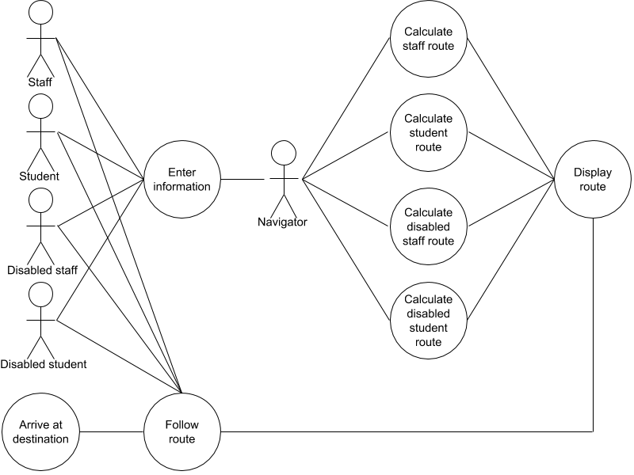
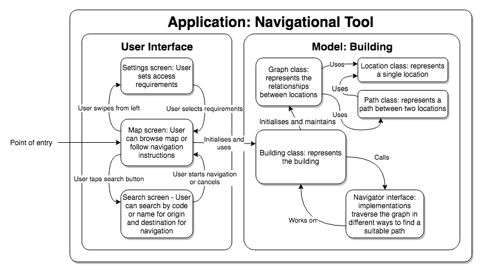
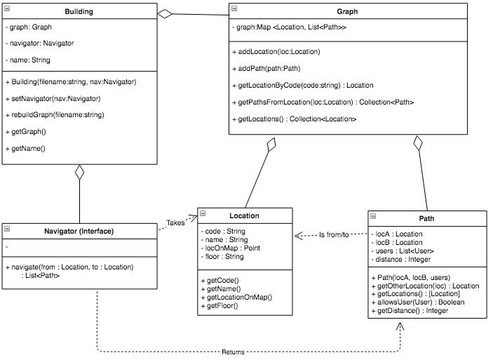

# Navigational Tool

### Portfolio A

## Overview

The School of Mathematics are moving to the Fry Building, which is currently being renovated, upon its completion in the summer of 2019. The building is very old and as such has a confusing layout due to being changed so much over the years, and wheelchair-accessible paths through the building are not always the most straightforward. 

Our client, John Newby, Move Manager of the School of Mathematics, wants to create a mobile app that will allow users of the Fry Building to efficiently find their way around the building. Because the building is not yet open, we will make the app for the Physics Building, which has a similarly confusing layout, and endeavour to make swapping out the building that the app works on as easy as possible. 

The key problem we need to solve is to create a suitable way for students and staff to find their way around the new building, including separate routing for disabled users who cannot use stairs or some entrances. The app will only be used by members of the University of Bristol and will have no wider impact.

We plan to realise the app as an Android application encompassing a map mode for easy reference, a search function for users to be able to identify where they are and where they would like to go, and a navigation mode that draws the route to follow onto the map and displays a list of directions. We will be using Android Studio and base Android systems to create the UI for the app, and the underlying logic will all be written in Java.
 

## Requirements

### Stakeholders

We first identified the following stakeholders:

*   Client
    *   The client needs to be able to port the app to the new maths building without much effort.
*   Building Users
    *   Students - Students will be the majority of users of the product
        *   Undergraduate students 
        *   Postgraduate students
    *   Staff - Staff may also be users of the product as the building is new
        *   Staff with increased access levels - Some staff have higher access levels that others
    *   Disabled Users - Disabled routes will require different pathways
    *   Visitors - Visitors will not know the layout so may need navigational help
*   The University
    *   The building owner/manager would need to be involved if we were to use beacons or some other form of user location device.

### Use Cases

The below diagram shows the use cases for a set of users, which includes key actors we identified who engage in our system- these are Staff, Students, Disabled staff and Disabled students, as well as the pathfinding component of the app itself, which is labelled as Navigator. We have decided to not include Visitors in the diagram as they are not members of the university, so are not within the scope of our project.

### Use Case Goals

As can be seen on the diagram, we have 3 key goals:

*   Enter Information
    *   Basic Flow
        *   User enters their priority level (student or staff)
        *   User enters their accessibility requirements (disabled or not)
        *   User enters origin and destination for navigation
    *   Alternative Flow
        *   User doesn't enter priority level or accessibility requirements 
        *   User enters origin and destination for navigation
        *   In this case they will be assumed to have the same priority level and accessibility requirements as the previous search if one exists, or as an able-bodied undergraduate student if not.
    *   Exceptional Flow
        *   User enters wrong priority level or accessibility requirements
        *   User enters origin and destination 
        *   In this case they will be incorrectly routed due to incorrect information being entered.  
*   Calculate Route
    *   Basic Flow
        *   The Navigator performs a breadth-first search from the origin on a subgraph of the building graph, with the appropriate sections removed. 
        *   It finds a route from the origin to destination, terminates and passes the route it found to the User Interface.
    *   Alternative Flow
        *   The Navigator performs its search. 
        *   It finds multiple routes from the origin to destination, terminates and passes the routes it found to the User Interface.
    *   Exceptional Flow
        *   The Navigator performs its search.
        *   It doesn't find a route from the origin to destination, terminates and throws an exception for the User Interface to handle.
*   Follow Route
    *   Basic Flow
        *   User follows the calculated route drawn on the map, along with the directions displayed, and arrives at their destination.
    *   Alternative Flow
        *   User follows an alternative route and arrives at their destination.
    *   Exceptional Flow
        *   User doesn't follow the calculated route and doesn't arrive at their destination.

### Atomic Requirements

Of the four use-case goals, Calculate Route is the most important as it is the core function of the application. The flow of this goal can be broken down into several atomic functional and non-functional requirements:

*   Functional Requirements
    *   The Navigator must find the shortest route allowed from origin to destination
        *   We will experiment with a selection of graph search algorithms to decide on one that can find the shortest route allowed in an efficient way.
    *   The Navigator must calculate different routes based on the access requirements of the user
        *   The paths the user cannot take are ignored, so the path displayed will follow the access requirements chosen.
    *   The route must be graphically displayable on the screen
        *   The route from the origin to destination calculated by the navigator is sent to the user interface, which displays it on the screen.
    *   The Navigator must be able to calculate the route from origin to destination for any given layout 
        *   So that our client is able to switch the layouts of buildings easily. There should be nothing hard-coded except a file path giving building information.
*   Non-functional Requirements
    *   The app should calculate any shortest route in under 2 seconds
        *   So the user can get to their destination quickly without waiting for the app to compute for too long - we will attempt to achieve this by using efficient algorithms and data structures.
    *   The app should be reliable and should not crash or hang
        *   We will design the Navigator to be a robust system and test all sensible use cases to ensure that this is the case, as well as ensure that in the event of an exception that the system warns the user and exits the navigation back to the app's standard view.

## 

## OO Design & UML

The architecture diagram shown below details the structure we plan to use for our application.

The diagram shows that our product will be a standalone application that includes its own model  to work on. The **UI** portion of the diagram models the dynamic relationship between the screens, while the **Model** portion shows the relationship between entities in the application.

The map screen will be shown when the application starts and represents the main interface - from here, the user can bring up the settings to set their access requirements, or bring up the search screen to start navigation by selecting an origin and destination for a route.

The **Building** class is the main model entity for our system - it contains superficial information, including the building name, and structural data such as the different floors, locations and paths in the building. Every query from the UI layer of the application is answered through the **Building** class. The **Location**, **Path** and **Graph** classes exist to store the aforementioned structural data - **Location** and **Path** represent their eponymous counterparts in the real world, while **Graph** maintains the relationships between them.

The **Navigator** interface is what gives a usable path between origin and destination, with different implementations using different rules: specifically the different access requirements of our users. The **Building** class will have an associated **Navigator** at all times, which can be swapped out if the user changes settings. We chose to create **Navigator** as an interface as this makes it easy to change the way the app finds the route - we can use different implementations to represent different access requirements or search algorithms.

The below diagram shows how we plan to implement the model and navigation aspects of our application. 

The **Building** class will be loaded from a CSV file to make it easy to port from the Physics building to the new Mathematics building - this means that the client only has to swap out a file to create the new version.

The class diagram provides an in-depth look into the first actual design we have for how we want to implement the application. We decided to start by designing the model specifics rather than that of the UI to ensure that the underlying systems work properly before we start building an interface on top. We have included all the methods that we expect to need in this first iteration, though more may be added in development if we find better ways to solve a problem. The completion of this design means that we can now start work on developing the application.

## Development Testing

The most important component of the system is the **Navigator**, which finds the shortest path allowed from origin to destination. In order to ensure that the algorithm works properly, we devised the following tests:

*   **TestNavigatorFindsOptimalRoute** - it throws an exception if the path found is not the shortest one
*   **TestNavigatorFindsOnlyAllowedRoute** - it throws an exception if the path found is not allowed for students, if the user is a student, or is not wheelchair accessible, if the user is disabled
*   **TestNavigatorThrowsOnNoRoute** - it throws an exception if the destination entered is not accessible to the user

In order to test the **Building** class and its methods, we are using a set of tests that guarantee the construction of the graph representing the building is correct:

*   **TestOnlyAndAllListedLocationsInGraph** and **TestOnlyAndAllListedPathsInGraph** ensure that all Locations and Paths given as a representation of the building are included in the graph
*   **TestDuplicateLocationThrows** and **TestDuplicatePathThrows** throw an exception if there are any duplicates
*   **TestAddingLocationWithUnkownFloorThrows**
*   **TestSetNavigatorChangesNavigator**
*   **TestGetNameCorrect** ensures that the getName method returns the correct string
*   **TestGetGraphReturnsCorrectGraph**

The **Graph** class is verified by the following tests:

*   **TestAddLocation** tests the addLocation method
*   **TestAddLocationFailOnNull** fails if the argument for the addLocation method is null
*   **TestAddPathThrowsOnUnknownLocation** throws an exception if the path attempted to add has null locations
*   **TestAddPath** tests the addPath method
*   **TestNoDuplicateLocationCodes** and **TestNoDuplicateLocationPositions** checks that no two locations have the same code or location on the map
*   **TestGetPathsFromLocationReturnsCorrectAddedPaths**
*   **TestGetLocationReturnsAllAddedLocations**

To test the **Location** and the **Path** classes, we are using **TestNullLocationArgumentThrows** and **TestNullPathArgumentThrows**, which throw an exception if any of the arguments are null. **TestBadUserThrows** tests if the user given to a path is valid and **TestNoUserThrows** ensures that every path can be taken by at least one user.

We are using the JUnit testing framework in order to develop these tests.
